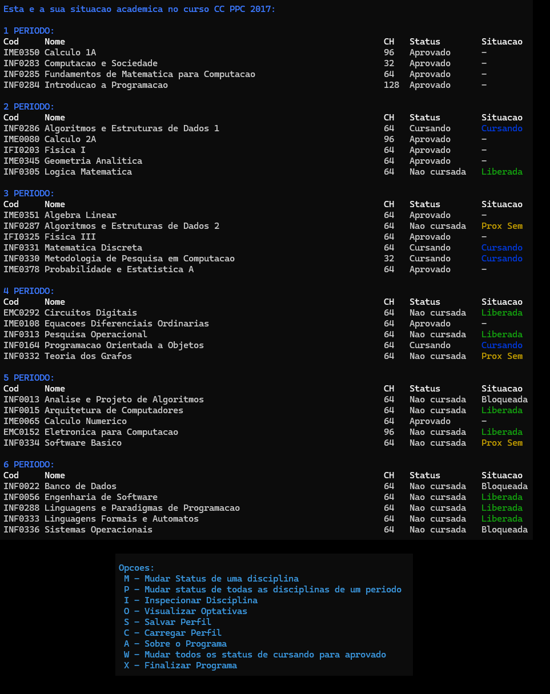

# TrabalhoIP
Programa feito na batata para mostrar quais disciplinas você já pode cursar esse semestre e quais vai pode cursar no próximo.
Também dá pra inspecionar uma disciplina pra ver quais são os pré-requisitos e quantas outras disciplinas ela trava.

No Linux:
  Abra no terminal e compile usando gcc:
  
  gcc GradeCC.c -o GradeCC
  
  .\GradeCC

No Windows:
  Basta executar o GradeCC.exe

